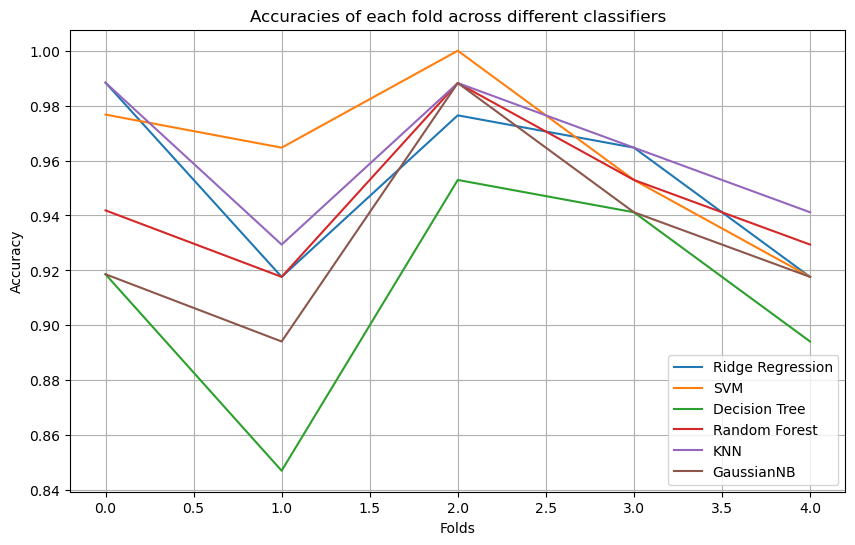
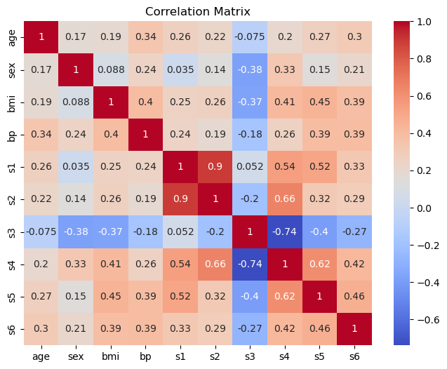
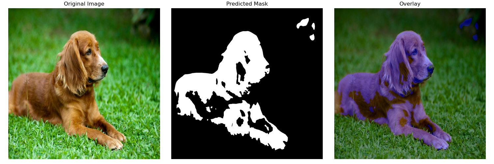
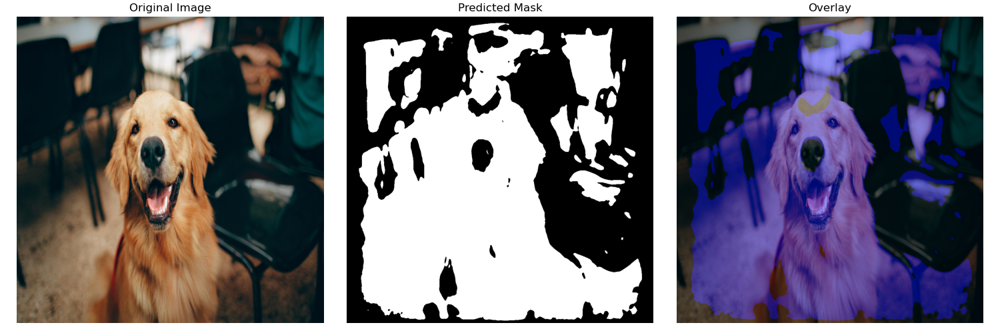

# MLOpsLeaning

This repository is a small collection consisting of machine learning practices.
It demonstrates basic knowledge in machine learning and common tools used for machine learning projects.

## Development Environment

For consistency, the project runs in a containerized environment.
Requirements:
- [Docker, Docker-Compose](https://docs.docker.com/desktop/setup/install/linux/ubuntu/)
- [nvidia-container-toolkit](https://docs.nvidia.com/datacenter/cloud-native/container-toolkit/latest/install-guide.html) if GPU-acceleration is available and desired
- [VS Code](https://code.visualstudio.com/download)
- [Dev Containers extension](https://marketplace.visualstudio.com/items?itemName=ms-vscode-remote.remote-containers)

> Of course there are other ways to create a consistent development environment. This is only a suggestion.

### Docker

The dependencies available in the environment are described inside `Dockerfile`.
The base image uses [Micromamba](https://mamba.readthedocs.io/en/latest/index.html) package manager for conda-compatibility, speed, and minimal default packages.
The base image also contains cuda runtime to ease the installation of CUDA-enabled Pytorch.

> Depending on the Nvidia driver, the base image tag and Pytorch installation might require some changes.

The host user is added and used inside the container, so the rights to mounted volumes are consistent inside the container and on the host machine.

There are two Docker stages:
- `build`: intended to be minimal and to have all the dependencies needed for CI/CD
- `dev`: intended to have all the tools that can help the development process

`docker-compose.yml` configures the build and deployment process.

### Dev Container

On top of the Docker setup, `.devcontainer/devcontainer.json` configures VS-Code environment.
Additional extensions can be added here.

### VS Code Configuration

`settings.json` configures settings for VS-Code and extensions.

`launch.json` contains debug configurations.

### Python Configuration

Installed tools related to Python (not VS-Code extensions) can be configured in `pyproject.toml`.

Even though dependencies are handled through Micromamba inside `Dockerfile`, we still demonstrate dependency management with package manager [Poetry](https://python-poetry.org/), a tool to facilitate dependency management and packaging for Python projects.

## Notebooks

These are simple Jupyter notebooks that can be run cell by cell.

`classificaton.ipynb` showcases different classifiers in a binary classification setting,
where the dataset used is [Scikit-Learn](https://scikit-learn.org/stable/index.html)'s Breast-Cancer dataset, which is rather small and has slight class imbalance.
It further shows the application of techniques like cross validation and hyperparameter optimization using Scikit-Learn and visualization using [Matplotlib](https://matplotlib.org/).

`regression.ipynb` starts with data analysis of Scikit-Learn's Diabetes dataset using [Pandas](https://pandas.pydata.org/) and [Seaborn](https://seaborn.pydata.org/index.html).
It continues to demonstrate how to handle incomplete data (the incompleteness is manually added) using Scikit-Learn imputation techniques,
and then applying cross validation and hyperparameter optimization to optimize the results of the trained model which is embedded in a pipeline.

## Unet

A small Deep Learning subproject, which trains a U-Net to solve image segmentation tasks.
In particular, a small dog image dataset with given ground-truth masks is used here.
The masks are binary masks that label each pixel depending on whether it belongs to the dog or not.
The U-Net is trained on the small dataset and applied to predict such masks on 10 new dog pictures.
There are good as well as bad results (depending on the "complexity" of the image) after only a low number of training epochs:

This showcases how a deep learning project can be modularly structured without Jupyter notebooks,
making it command-line friendly, e.g. when working on a remote server is required.
It also shows familiarity with the deep learning framework [PyTorch](https://pytorch.org/),
using its modules to build the datasets, model and training pipeline.

Here are the core modules:
- `Unet/config/config.json`: Central configuration file for the whole pipeline.
- `Unet/src`: Contains all the Python modules
    - `dataset.py`: Implements dataset used during training and inference.
    - `model.py`: Implements Unet neural network for segmentation tasks.
    - `trainer.py`: Implements the whole training process.
    - `predictor.py`: Implements the inference process.
    - `main.py`: Entrypoint, starts the process depending on configuration.

There are also `Unet/data` and `Unet/weights` that are ignored by Git
but tracked via [Data Version Control (DVC)](https://dvc.org/),
a tool that, combined with Git, facilitates the versioning of datasets (but also different kind of files).

To run the process:
1. Get data using `dvc pull`
    - Requires authentication for security reason, so it's better to use some other dataset
2. Navigate to `Unet` via `cd Unet`
3. Run `python main.py`
    - With argument `--config <path/to/some/config/file>` for specific config file
    - With argument
        - `--mode train` if only training desired
        - `--mode predict` if only inference desired
        - `--mode all` if both desired
    - The training mode can also be configured in config file

Training mode will train the model, save its weights (if save path given),
and plot the training and validation performance.

Inference mode will take the given weights and predict on given directory with images.
This will produce image triplets of orignal image, predicted segmentation mask, and an overlay.
